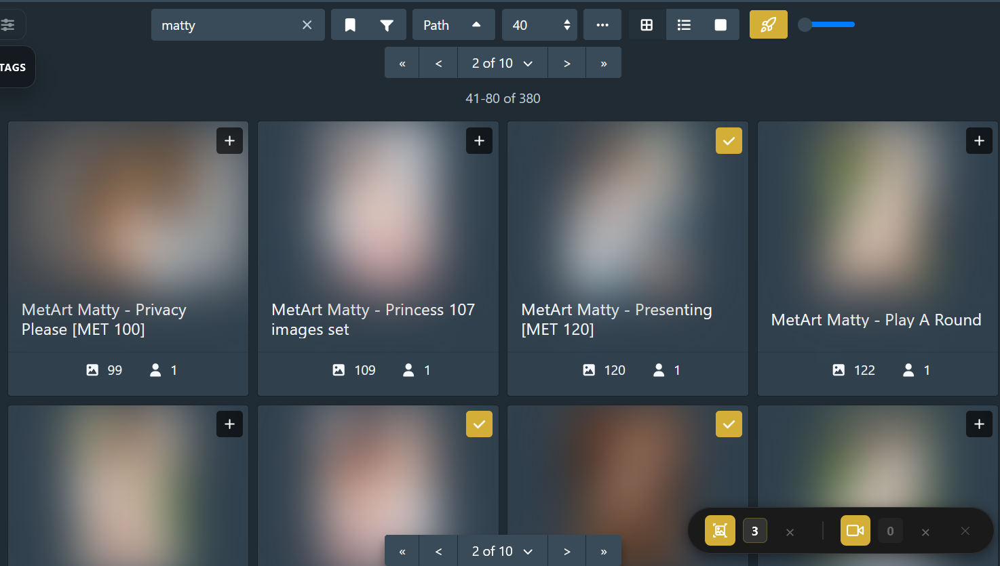
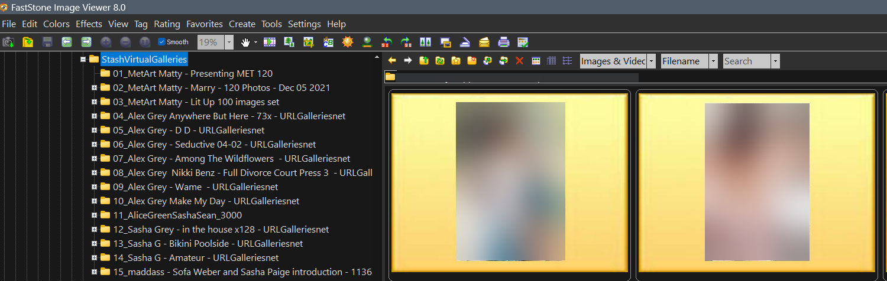

# 🚀 Universal Media Launcher (UML) for Stash

A Stash plugin to queue up multiple **Galleries** and **Scenes** to independent playlists and launch them directly from your favorite native desktop applications.
Bypass the browser's video encoding boundaries and image rendering lags completely by routing your Stash media straight to your local operating system players.

## Features
- Open Scenes in desktop **Video players** applications
- View Galleries in desktop **Image viewers** applications
- Create **playlists** for your scenes and galleries and play them in external applications
- Playlists are stored in the browser and survive server and browser's restarts
- Launch your playlists from any page inside stash using the widget launcher
- Works on **Windows** and **Linux**
- Supports environment path variables for the external applications paths

## Main Motivation

### Galleries
I prefer browsing galleries with a directory list sidebar and keyboard fast navigation, stash is great for organizing, tagging and finding your content but its gallery viewer is lacking for me. This plugin merges the best of both worlds, you can quickly browse through your galleries in stash and add them to a playlist, afterwards have your favorite desktop application open them.

To achieve this i used a simple solution: to create virtual folders on Windows and symlinks on Linux, which take virtually no space in your drive and let you browse the galleries that you chose.
Personally i recommend a image viewer like FastStone for windows or Geeqie for linux, to browse those virtual folder nicely, but you can use whatever you prefer.

### Videos
When Stash needs to transcode videos because of browser's unsupported codecs sometimes can be frustrating, in these instances this plugin let you play those videos in a desktop player of your choice.
Another benefit is being in total control of your playlist queue.
You may also enjoy the shortcuts, controls and user experience that some desktop players offer.

## Installation

### Option 1 — Automatic (recommended)

    In Stash go to Settings → Plugins → Add Source and enter:
    https://theuser9839.github.io/stash_plugins/main/index.yml
    Find Universal Media Launcher in the plugin browser and click Install

### Option 2 — Manual

    Download this repository (Code → Download ZIP) and extract it
    Place the UniversalMediaLauncher folder inside Stash plugins directory.

## Requirements
    To use the galleries launcher in Windows (not required on Linux) you must be able to run Stash as Administrator to create the virtual folders.

## How to Use: Short Version
1. Configure the applications paths in Stash Settings -> Plugins.
2. Navigate to a Stash page with scenes or galleries, such as Galleries or Scenes, or into a specific Performer/Studio.
3. Click on the **Universal Media Launcher** picker toggle icon (🚀 it's a rocket!)
4. Add galleries and Scenes to your playlist by clicking on the cards's '+' overlays
5. Click the floating widget's icons to launch the playlists.


## How to Use: Extended
1. Go to your Stash Settings -> Plugins.
2. Find Universal Media Launcher and configure the applications paths.
3. Navigate to a Stash page with scenes or galleries, such as Galleries or Scenes, or into a specific Performer/Studio.
4. Locate the **Universal Media Launcher** picker toggle icon (🚀 it's a rocket!) on the right of the stash toolbar before the zoom slider.
5. Click the rocket to activate picking mode, it will render `+` badges to card thumbnails and a widget on the bottom right.
6. Click the '+' on the scenes or galleries you want to save to the playlists.
7. Scenes and galleries have different playlists. You will see the widget updating each playlist count.
8. Click the floating widget icons on the bottom right of your screen to launch the desired queue in your selected app.
9. At any time you can un-ticked a ticked item for it to be removed from the playlist. Or you can clear the entire playlist with X icons-
10. Closing the widget or toggling picking mode off will clean the virtual directories if you configured that way in the plugin settings.

## Screenshots
This is the Galleries tab of stash view the plugin toggle picker activated and 3 galleries already selected.



Now an example of what happens when you open some galleries with a desktop app, FastStone in this case:



## Disclaimer

I created this plugin using AI, i never coded a python or javascript project before.
I took heavy inspiration in the Stash Multiview plugin by ordureconnoisseur:

     https://github.com/ordureconnoisseur/plugins/tree/main/plugins/multiView

And by heavy inspiration i mean literally copied it's UI code then had AI worked over that to make the changes i needed. Multiview picker its amazing and looks good.
If you find any bugs, please report them, if you want some more features request them and i will consider them, though i rather keep this minimal.

## Repository Structure
For a clean installation, ensure your Stash plugins folder structure matches this layout:
```text
.stash/plugins/UniversalMediaLauncher/
├── UniversalMediaLauncher.yml
├── frontend/
│   ├── main.js
│   └── main.css
└── backend/
    ├── main.py
    └── launcher.py
```

## Default Configurations

Universal Media Launcher features native system fallbacks. To change your viewing applications, navigate to **Settings -> Plugins -> Universal Media Launcher** inside Stash and adjust the path strings.

### Windows Setup Examples
#### 1. Default Built-in Applications (No extra software needed)
- **External Image Viewer Application Path**: `explorer` *(Default placeholder. Automatically resolves your queue in sequential `01_Name` directory folders and opens the native Microsoft Photos App).*
- **External Video Player Application Path**: `C:\Windows\System32\wmplayer.exe` *(Bypasses the UWP sandbox to play your scene selections back-to-back in Windows Media Player).*

#### 2. Specialized Media Players 
- **External Image Viewer Application Path**: `C:\Program Files (x86)\FastStone Image Viewer\FSViewer.exe`
- **External Video Player Application Path**: `C:\Program Files\MPV\mpv.exe` *(or VLC / MPC-HC absolute paths)*

### Linux Setup Examples
- **External Image Viewer Application Path**: `viewnior` *(or `feh` / `gwenview`)*
- **External Video Player Application Path**: `mpv` *(or `vlc` / `xdg-open` for system default file managers)*


## Tested Image Viewers

This is just an initial list of what i have tested so far, but most of desktop applications should work. You can let me know if of your tests results and i will update the list eventually.

### Windows
FastStone Viewer ✔️
IrfanView ✔️
XnView MP ✔️

## Tested Video Players

### Windows
MPV ✔️
Media Player Classic ✔️
VLC ✔️
Wmplayer ✔️

### Linux
MPV ✔️

## Roadmap
Maybe add a Playlist Drawer eventually, for users who want to know to the exact contents of the queue at any given time and edit previously added items when not using the same search filters anymore. Probably only if people use the plugin and want it.
